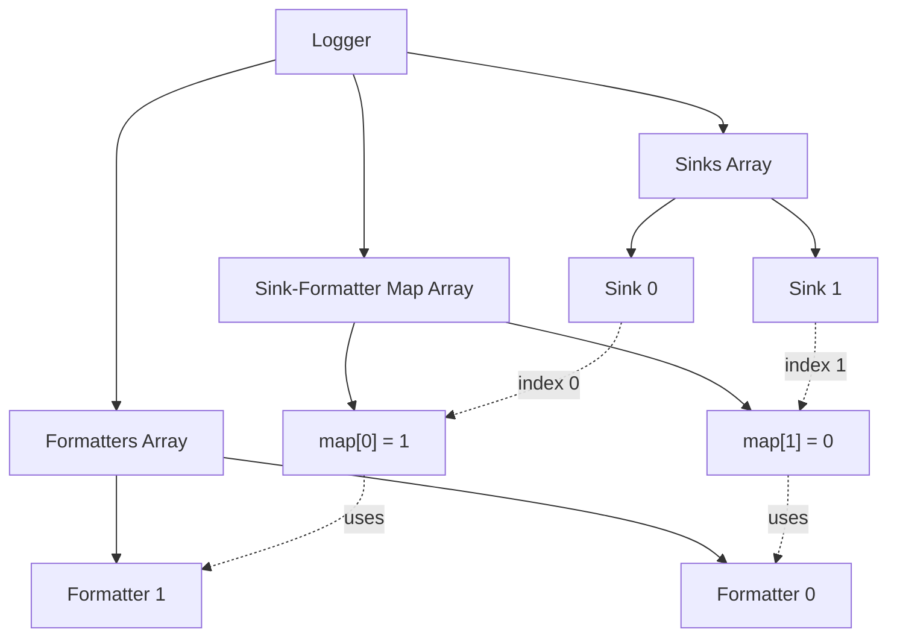

# Api

This is a description of timber C api

---

## Logging

---
Logger contains array of formatters and array of sinks,
they are associated with each other using another array
where under an index representing a sink there is a number representing index
of formatter to use for that sink.  



:::note
Formatter with index 0 is considered the default formatter.
:::

### tmb_log_default(ctx, message, ...)

```c
void tmb_log_default(tmb_log_ctx_t ctx, const char* message, ...);
```

Logs a message with the default logger.

### tmb_log(ctx, logger, message, ...)

```c
void tmb_log(tmb_log_ctx_t ctx, tmb_logger_t* logger, const char* message, ...);
```

Logs a message with specified logger.

### MACROS

```c
TMB_LOG_FATAL(logger_or_format, ...)
TMB_LOG_ERROR(logger_or_format, ...)
TMB_LOG_WARN(logger_or_format, ...)
TMB_LOG_INFO(logger_or_format, ...)
TMB_LOG_DEBUG(logger_or_format, ...)
TMB_LOG_TRACE(logger_or_format, ...)
TMB_LOG(log_level, logger_or_format, ...)
```

:::note
The `TMB` prefix on above macros is stripped by default, if that is not
desirable define `TMB_DONT_STRIP_PREFIX` before including the header or as a
compile option.
:::

---

## Logger

### tmb_logger_create(logger_name, cfg)

```c
#define TMB_LOGGER(_m_name, ...)
tmb_logger_t* tmb_logger_create(const char* logger_name, tmb_logger_cfg_t cfg);
```

Creates a new logger with the specified name and configuration.

Following options are available:

```c
typedef struct tmb_logger_cfg {
    tmb_log_level log_level;    // default = TMB_LOG_LEVEL_INFO
    bool enable_colors;         // default = true
} tmb_logger_cfg_t;
```

### tmb_logger_destroy(logger)

```c
void tmb_logger_destroy(tmb_logger_t* logger);
```

Destroys the specified logger and frees associated resources.

### tmb_logger_set_default_format(logger, fmt)

```c
bool tmb_logger_set_default_format(tmb_logger_t* logger, const char* fmt);
```

Sets format used by the default formatter.

Returns:

- *success* : `true` when format was correctly instantiated.
- *failure* : `false` when format was not correctly instantiated.

### tmb_logger_add_format(lgr, fmt)

```c
int tmb_logger_add_format(tmb_logger_t* lgr, const char* fmt);
```

Creates and adds a formatter to the specified logger.

Returns:

- *success* : `a positive number`, formatter's index when correctly instantiated.
- *failure* : `a negative number`, when formatter couldn't be correctly instantiated or couldn't be added to the logger.

### TMB_LOGGER_ADD(logger, sink, formatter)

```c
#define TMB_LOGGER_ADD(logger, sink, formatter)
```

Macro for adding a sink and formatter to a logger.

### tmb_logger_add_formatter(lgr, formatter)

```c
int tmb_logger_add_formatter(tmb_logger_t* lgr, tmb_formatter_t formatter);
```

Adds a formatter to the specified logger.

### tmb_logger_add_sink(lgr, sink)

```c
int tmb_logger_add_sink(tmb_logger_t* lgr, tmb_sink_t* sink);
```

Adds a sink to the specified logger.

### tmb_logger_assign_format(lgr, sink_idx, fmt_idx)

```c
int tmb_logger_assign_format(tmb_logger_t* lgr, int sink_idx, int fmt_idx);
```

Assigns a formatter to a sink in the specified logger.

### tmb_logger_add_tag(lgr, tag)

```c
void tmb_logger_add_tag(tmb_logger_t* lgr, const char* tag);
```

Adds a tag to the logger. Tags are used by the `t` template option.

### tmb_logger_remove_tag(lgr, tag)

```c
void tmb_logger_remove_tag(tmb_logger_t* lgr, const char* tag);
```

Removes a tag from the logger.

---

## Logger Registry

### tmb_register_logger(name, logger)

```c
void tmb_register_logger(const char* name, struct tmb_logger* logger);
```

Registers a logger with the specified name in the global registry.

### tmb_get_logger(name)

```c
struct tmb_logger* tmb_get_logger(const char* name);
```

Retrieves a logger by name from the registry.

### tmb_get_logger_or_default(name)

```c
struct tmb_logger* tmb_get_logger_or_default(const char* name);
```

Retrieves a logger by name from the registry, or returns the default logger if not found.

---

## Formatters

### tmb_formatter_make(fmt)

```c
#define TMB_FORMAT(fmt)
tmb_formatter_t tmb_formatter_make(const char* fmt);
```

Creates a formatter with the specified format string.  
[Format Guide](./format.md).

### tmb_formatter_deinit(formatter)

```c
void tmb_formatter_deinit(tmb_formatter_t* formatter);
```

Deinitializes and cleans up a formatter.

### tmb_formatter_graylog_make()

```c
#define TMB_FORMAT_GRAYLOG()
tmb_formatter_t tmb_formatter_graylog_make(void);
```

Creates a specialized formatter for Graylog output.

### tmb_formatter_json_make(opts)

```c
#define TMB_FORMAT_JSON(...)
tmb_formatter_t tmb_formatter_json_make(tmb_json_formatter_opts_t opts);
```

Creates a JSON formatter with the specified options.

Available options:

```c
typedef struct tmb_json_formatter_opts {
    bool has_timestamp;     // default = false
    bool has_stopwatch;     // default = false
} tmb_json_formatter_opts_t;
```

For performance reasons json formatter by default skips timestamps and stopwatch.

---

## Sinks

Each of the following sinks has an option to filter its output by logging level. This is achieved by using the tmb_sink_opts struct.

```c
struct tmb_sink_opts {
    tmb_log_level min_log_level;    // default = TMB_LOG_LEVEL_DEBUG
};
```

### tmb_sink_fd_create(opts, fd)

```c
#define TMB_SINK_STDOUT(...)
#define TMB_SINK_STDERR(...)
#define TMB_SINK_FD(fd, ...)
tmb_sink_t* tmb_sink_fd_create(struct tmb_sink_opts opts, FILE* fd);
```

Creates a sink that writes to a file descriptor.

### tmb_sink_file_create(opts, filename)

```c
#define TMB_SINK_FILE(filename, ...)
tmb_sink_t* tmb_sink_file_create(struct tmb_sink_opts opts, const char* filename);
```

Creates a sink that writes to a regular file.

### tmb_sink_rotating_file_create(opts, filename, max_files, max_file_size_B)

```c
#define TMB_SINK_ROTATING_FILE(filename, max_files, max_file_size_B, ...)
tmb_sink_t* tmb_sink_rotating_file_create(struct tmb_sink_opts opts,
                                          const char* filename,
                                          int max_files,
                                          int max_file_size_B);
```

Creates a rotating file sink that rotates log files based on size and count limits.

### tmb_sink_graylog_create(opts, graylog_host, port)

```c
#define TMB_SINK_GRAYLOG(graylog_host, port, ...)
tmb_sink_t* tmb_sink_graylog_create(struct tmb_sink_opts opts,
                                    const char* graylog_host,
                                    int port);
```

Creates a sink that sends log messages to a Graylog server.

### tmb_sink_null_create()

```c
#define TMB_SINK_NULL()
tmb_sink_t* tmb_sink_null_create();
```

Creates a null sink that discards all output.

### tmb_sink_destroy(sink)

```c
void tmb_sink_destroy(tmb_sink_t* sink);
```

Destroys a sink and frees associated resources.

---

## Library Configuration

### TMB_CFG(...)

```c
#define TMB_CFG(...)
```

Macro for inline configuration of the library.

### tmb_set_global_options(cfg)

```c
void tmb_set_global_options(tmb_lib_cfg_t cfg);
```

Sets global library options.

Configuration structure:

```c
typedef struct tmb_lib_cfg {
    tmb_log_level log_level;
    bool enable_colors;
    int default_sink_fd; // either 1 (stdout) or 2 (stderr)
} tmb_lib_cfg_t;
```

Default values:

```c
.log_level = TMB_LOG_LEVEL_TRACE,
.enable_colors = true,
.default_sink_fd = 2
```

### tmb_print_version()

```c
void tmb_print_version(void);
```

Prints the library version information.

### tmb_get_version()

```c
const char* tmb_get_version(void);
```

Returns the library version as a string.

### tmb_get_default_logger()

```c
struct tmb_logger* tmb_get_default_logger();
```

Returns a reference to library's default logger.

---

## Configuration Management

### tmb_config_load(filename)

```c
struct tmb_config* tmb_config_load(const char* filename);
```

Loads configuration from a file.

### tmb_config_from_string(config)

```c
struct tmb_config* tmb_config_from_string(const char* config);
```

Loads configuration from a string.

### tmb_config_get_format(config, format_name)

```c
const char* tmb_config_get_format(struct tmb_config* config, const char* format_name);
```

Retrieves a format string by name from the configuration.
